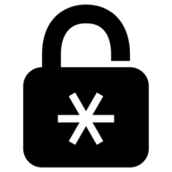

<h1>
   Password Manager
</h1>

[](https://travis-ci.org/github/the0neWhoKnocks/password-manager/builds)
[](https://github.com/the0neWhoKnocks/password-manager/releases)
[](https://hub.docker.com/repository/docker/theonewhoknocks/password-manager)

[](https://codecov.io/gh/the0neWhoKnocks/password-manager/branch/)

A Password Manager designed to be run over your LAN.

---

## Features

- Multiple User accounts
- All sensitive information is encrypted via a User's password so not even the
App's Admin can view the data once it's been saved.
- User's can export/import their data.
- User's can filter down credentials based on label name. If you have a ton of
credentials, this can save you some scrolling.
- User's can choose to hide values on load by adding the `hideValues=true`
query parameter. 

---

## Install

To install in a Dockerized environment, you can utilize the `docker-compose.yml`
file in this repo.

---

## Development

### Installation

```sh
npm i
```

### Run the App

**Via Node**
```sh
npm start
# or for Dev (starts a BrowserSync & Nodemon watcher)
npm run start:dev
```

**Via Docker**
```sh
docker-compose up
```

### Testing

Running Unit tests
```sh
npm run test
# or to test individual file(s)
npm run test:watch <regex>
```

### Debugging the App

To see more info about what's going on in the Server you can add this query param
```
?debug=*
```
After you refresh the page you'll see more logging prefixed with `passman`. If
there's a particular area you want to focus on, you just have to update the
param to a log suffix value. So if you see a log like `passman:view`, you just
have to update the param to:
```
?debug=view
```

---

## Releasing

1. Prep the repo
   - Ensure the info in `./bin/releaseConfig.sh` is correct for your repo.
   - Create a `CHANGELOG.md` if one does not already exist. The contents should
   be this.
      ```md
      # Changelog
      ---

      ```
1. Run `./bin/release.sh` and follow the steps.
   - To skip having to enter a Docker password every time, create a
   `.dockercreds` file in the same directory as `release.sh` and put your
   password in there.
   - In order to automatically convert git tags to actual releases you'll need
   to generate a [Personal Access Token](https://github.com/settings/tokens),
   and add it to your global git config `git config --global github.token <YOUR_TOKEN>`.

If something happens during the final stage of the release, you'll have to
manually reset some things.
```sh
# Reset the last commit
git reset --soft HEAD~1
# Verify that just release files will be reset. You should just see:
# - `CHANGELOG.md`
# - `package-lock.json`
# - `package.json`
git status
# If the above is good, unstage those changes
git reset
# Reset changed files
git checkout -- CHANGELOG.md package.json package-lock.json
# Check if a git tag was created
git tag | cat
# If so, remove it
git tag -d <TAG_NAME>
```
